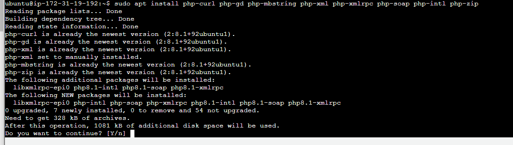

# ***INSTALACIÓN WORDPRESS EN LAMP***
## Instalamos otros pñaquetes php necesarios que nos seviran para poder trabajar más adelante.

## Creamos la base de datos con la que trabajaremos y en ella creamos y daremos todos los permisos al usuario *wp_user219*.

## Actualizamos para que el paso anterior tenga efecto.

## Volvemos a editar el fichero *000-default.conf* para añadir nuevas líneas.

## Gracias al siguiente comando podemos usar la función de enlace permanente de **WordPress**.

## Instalamos el paquete *wget* el cual nos será útil para descargar los archivos de **WordPress**. Utilizando el comando anterior descargamos **WordPress**.

## Ahora instalamos *unzip*.  

## Una vez descomprimido el archivo descargado, lo movemos a la carpeta indicada, cambiamos el usuario propietario y reinicamos el servicio para que se actualice.

## Comprobamos que todo lo anterior funciona correctamente.

## Introducimos los datos de la base de datos creada anteriormente para conectarnos a ella.

## Rellenamos la información para la creación del sitio web.

## Aqui esta la comprobación final de que todo esta correcto.
